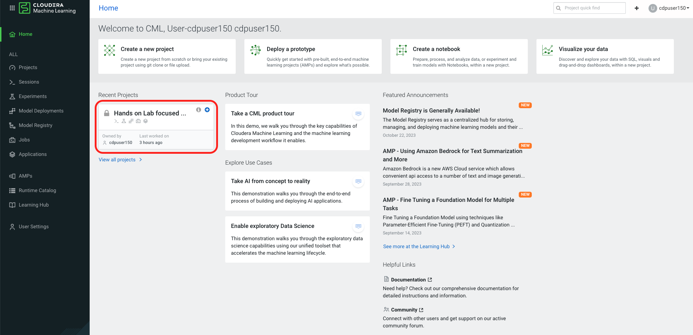
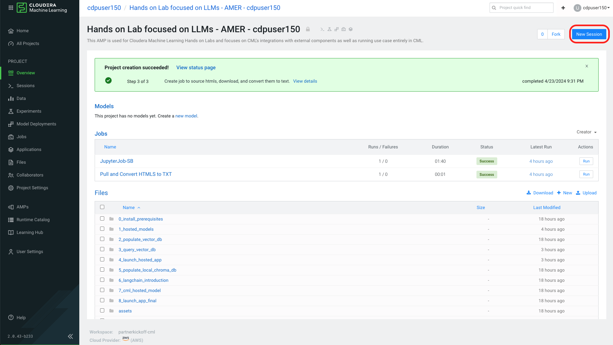
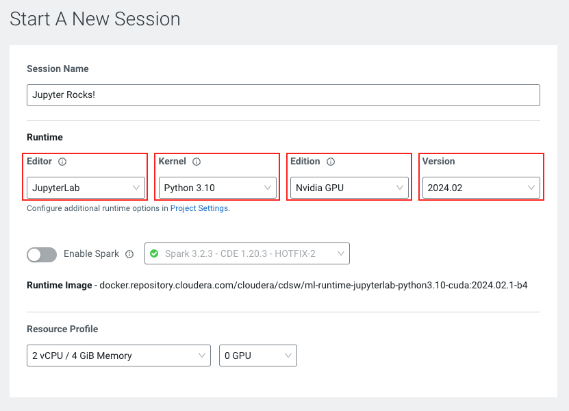
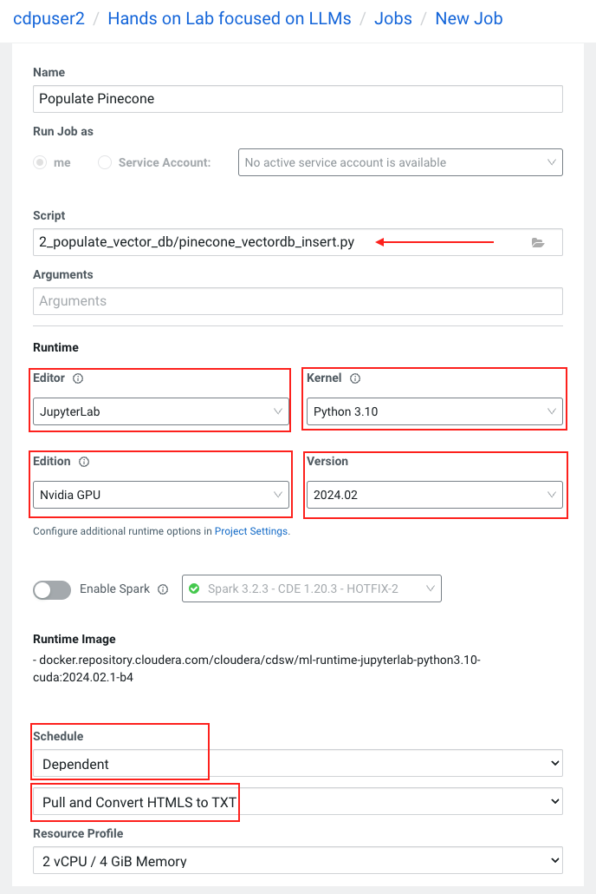
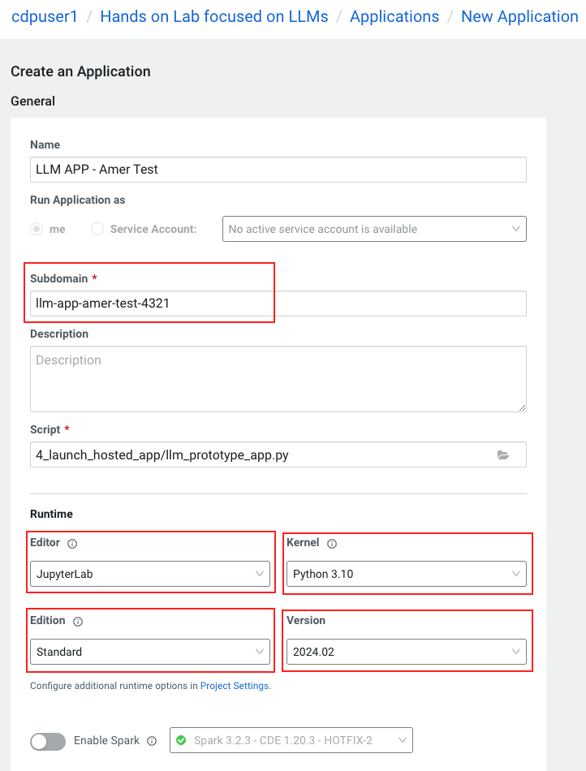
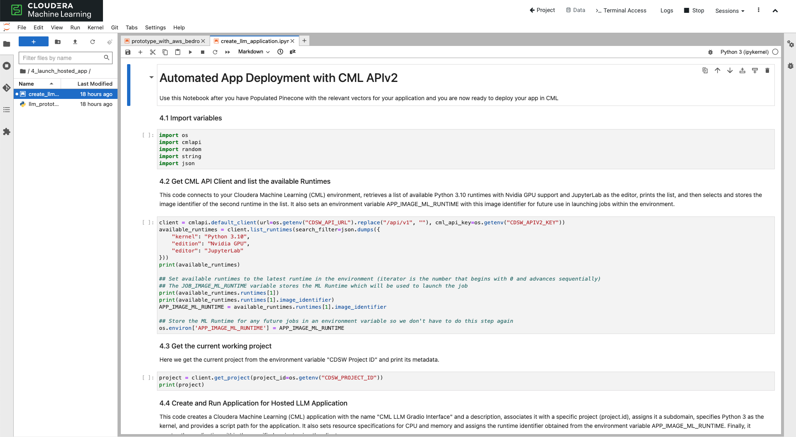
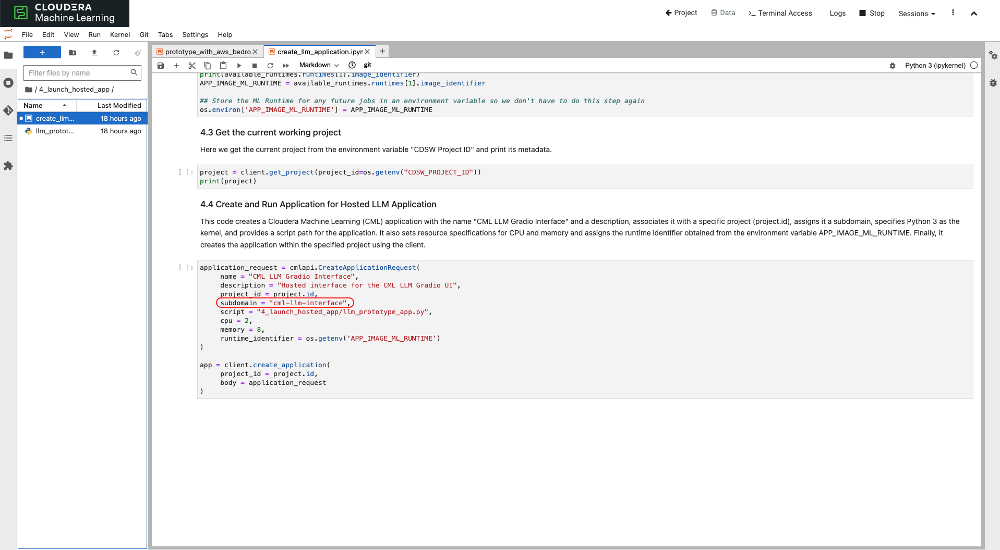

# Large Language Models with Cloudera

The goal of this hands-on lab is to explore Cloudera Machine Learning (CML) through the lens of the [Retreival Augmented Generation](https://arxiv.org/abs/2312.10997) (RAG) architecture for Large Language Models. Starting from a simple Jupyter notebook and finishing with a complete chatbot application, participants will get to know some of the key CML features and advantages. In a real-world scenario, changing business requirements and technology advancements requires agility and CML is a great tool to enable Data Science practitioners to build use cases quickly.

Because the applications of LLMs can be quite broad across industries, we will hone in on a particular use case for the purposes of this lab. 

> **Lab use case:** A software vendor is looking to pilot an LLM-based chat interface to improve employee productivity when searching product documentation.
 
## Lab Flow

Ultimately, the lab aims to demonstrate the ease and flexibility in which users can prototype new approaches and integrate them into fully-packages solutions like LLM applications.

There are currently 4 exercises in the lab, and others will be added soon. It is important to follow the exercise order, as there are dependencies between different stages. 
  - [0. Getting into CML](#getting-into-cml)
  - [1. Exploring Amazon Bedrock through CML](#1-exploring-amazon-bedrock-through-cml)
  - [2. Scrape and ingest data and populate Pinecone DB](#2-scrape-and-ingest-data-and-populate-pinecone-db)
  - [3. Explore your data via Pinecone DB](#3-explore-your-data-via-pinecone-db)
  - [4. Deploy a CML application](#4-deploy-a-cml-application)
  <!-- - [5. Switch Vector DB to Chroma DB](#5-switch-vector-db-to-chroma-db)
  - [6. Langchain](#6-langchain)
  - [7. Use a locally hosted LLama2 model](#7-use-a-locally-hosted-llama2-model)
  - [8. Launch Final Application](#8-launch-final-application) -->

## 0. Getting into CML

After login, you will be taken to the home screen of Cloudera Data Platform. From here you can access CML - one of its Data Services.

> **0a.** Click on the "Machine Learning" icon.


> **0b.** Then click on ML Workspace called _partnerkickoff-cml_.


If you are new to CML, take a moment to explore the dashboard.

Cloudera uses the concept of _projects_ to organize the workspace. Each project is typically linked to a remote repository (e.g. git) and can have multiple collaborators working on it. In the interest of time, a _Hands on Lab focused on LLMs - AMER_ project has already been created for you and you are the sole _Owner_ of that project. 

> **0c.** When ready click into the project:


Take a moment to familiarize yourself with the project page. Notice that your project now has all required files (your code base), a readme below, project specific options in the left hand column, plus more. Throughout the lab you will use many of the features listed here.


## 1. Exploring Amazon Bedrock through CML

In this first section, we'll interact with a model (Anthropic's Claude) via Amazon's Bedrock service. To do this we will start a _Session_ with a Jupyter notebook UI. 

>**1a.** Start a session by clicking _New Session_ in the top right corner. Alternatively you can click on _Sessions_ in the sidebar and click _New Session_ there.


>**1b.** Give you session a name (e.g. "Jupyter Rocks!"). 
>* For **Editor** select _JupyterLab_ 
>* For **Kernel** select _Python 3.10_
>* For **Version** select _2023.12_
>* For **Edition** select _Nvidia GPU_ 
>* Leave the other settings as is.
>

>**1c.** Click _Start Session_ in the bottom right.

>**1d.** After a few seconds your isolated compute pod, running Jupyter UI, with Python 3.10 Kernel and additional GPU libraries will be ready. 

>**1e.** A pop-up will open suggesting data connection code snippets to get started. You can select _Don't show me this again_ and close the pop-up window.

> **1f.** You will now see a familiar Jupyter notebook interface. In the left navigation panel go to ```1_hosted_models``` folder and open ```prototype_with_aws_bedrock.ipynb``` by double-clicking it.


>**1g.** As you walk through the notebook review the explanations and run each cell (you can use ```Enter+Shift``` or ```Command+Enter```). Alternatively, you can click on the "Play" button at the tom of the notebook. When you are finished going through the notebook come back to this guide. 


:pencil2: You have now gotten familiar with creating a CML session, working with JupyterLab editor and interacted with a 3rd party LLM provider. All within an isolated and secure compute pod.

## 2. Scrape and ingest data and populate Pinecone DB

In this section you will define a CML _Job_ to load text data into a [Pinecone](https://www.pinecone.io/) vector database. Jobs are responsible for running scripts in a specific, isolated environment (just like sessions from exercise 1). Jobs can run on a schedule, on-demand, or be joined together into pipelines. 

For this exercise, HTML links are already provided in the ```2_populate_vector_db/html_links.txt``` file. These sample links point to various pages of [Cloudera's CML documentation](https://docs.cloudera.com/machine-learning/cloud/). In this lab you have an option to point to other URL location(s) by updating this file. However, any time you update the links you will also need to rerun the job. 

There are two ways to create a JOB in CML: via the UI or programmatically with [CML's APIv2](https://docs.cloudera.com/machine-learning/cloud/api/topics/ml-api-v2.html). In production you would likely opt for the second option. For this exercise, it's useful to create a job through the UI so we can understand the process a bit better. 

>**2a.** Note that your project already has one job, namely _Pull and Convert HTMLS to TXT_. This job will be a dependency of a new job you create. You do not need to run it just yet.


>**2b.** In the left sidebar, click on _Jobs_.


>**2c.** Press _New Job_ in the top right corner.


>**2d.** On the next screen, give your job a name.

>**2e.** Under **Script** browse to ```2_populate_vector_db/pinecone_vectordb_insert.py``` by clicking on the folder icon.

> **2f.** Ensure you've selected the right runtime settings, per below:
>* For **Editor** select _JupyterLab_ 
>* For **Kernel** select _Python 3.10_
>* For **Version** select _2023.12_
>* For **Edition** select _Nvidia GPU_ 

>**2g.** Under **Schedule**, select _Dependent_, then select the job _Pull and Convert HTMLS to TXT_. 

> **2h.** Finally click _Create Job_, scrolling all the way down.

Great! Now you've created your very own CML job! You can run the scraping job and the populate vector DB job will kick off automatically after that. 

>**2g.** Go back to _Jobs_ (as shown above in substep 2b)

>**2h.** Click the _Run as_ button for the _Pull and Convert HTMLS to TXT_ job. Note that jobs can also be triggered using a [machine user](https://docs.cloudera.com/management-console/cloud/user-management/topics/mc-machine-user.html) (a.k.a. service account).   


After just over a minute you should see both of your jobs completed successfully. While the jobs are running you can review the code in ```2_populate_vector_db/pinecone_vectordb_insert.py```, by navigating to _Overview_ > _Files_ in a new tab.


:pencil2: CML jobs give users an ability to automate recurrent tasks and streamline the workflow for a machine learning project. You have seen CML interact with a popular 3rd party vector database within an isolated compute framework. 

## 3. Explore your data via Pinecone DB

In this exercise you will interact with the knowledge base that has been loaded in a Pinecone vector database in [Exercise 2](#2-scrape-and-ingest-data-and-populate-pinecone-db). 

>**3a.** Click on _Sessions_ in the left sidebar. If the session you've created before has expired, click _New Session_ in the top right and follow the steps in **1b**. Otherwise, click on your session to return to it. 


>**3b.**  Once Jupyter UI comes up, open file ```3_query_vector_db/pinecone_vectordb_query.ipynb``` by double clicking it.


>**3d.** Work through the notebook by running each cell. When you are finished come back to this guide.

:pencil2: You have now not only populated, but also retreived context chunks from a Pinecone Vector DB using CML. You have all of the starting building blocks for building a full RAG-based, LLM application.

## 4. Deploy a CML application

So far we have interacted with our models and vector database through a Jupyter notebook. Now lets see how a user might interact with an LLM solution through a CML application. CML can be used to deploy UI applications based on popular frameworks (e.g. [flask](https://flask.palletsprojects.com/en/3.0.x/), [streamlit](https://streamlit.io/), [gradio](https://www.gradio.app/)) for deploying applications. In this lab we'll be deploying a gradio app to interact with the model using a chat interface. 

The exercise will walk you through the steps to deploy the application using the UI. We'll also explore how to do this programatically through the CML APIv2. 

>**4a.** Go back to your project screen, by clicking  in the top bar of your session. 

>**4b.** In the left sidebar click on _Applications_. 


>**4c.** Press _New Application_ in the middle of the screen.

>**4d.** Name your application. Here we name it ```LLM APP```

>**4e.** Provide a creative subdomain name. This has to be **unique**.

>**4f.** Select the following path for your application **Script**:
```4_launch_hosted_app/llm_prototype_app.py```

>**4e.** Ensure you have selected the right container settings for the application, per below:
>* For **Editor** select _JupyterLab_ 
>* For **Kernel** select _Python 3.10_
>* For **Version** select _2023.12_
>* For **Edition** select _Nvidia GPU_ 

>**4e.** For resource profile, select _2 vCPU / 4 GB Memory_. Overall, aside for the subdomain, settings should look like the below screenshot.


>**4f.** Click _Create Application_ at the bottom of the page.

### Interacting with an Application
The application will take a couple of miuntes to start, once it does you can click on its card to open the UI. While it's starting you can review the code in ```4_launch_hosted_app/llm_prototype_app.py```.

You will notice reliance on some environment variables. These have been setup at the ML Workspace level and can be shared accross all projects. Alternatively, environment variables can be specific to a Project or even a session, job, or application. 

You might also notice this script shares some functions with the code we used earlier to query our Pinecone database. The new response function also considers which model the user selects to complete the response. This highlights the power of modularity in CML.

>**4h.** Check to confirm your app has deployed successfuly. You should see a message confirming this. 


>**4i.** Click on the App's URL to navigate to the Gradio UI. In a new tab you should see the appliction open:


Take some time to ask different questions about CML. Some examples to get you started... 
- What is ML Runtime?
- What is the latest CML release?

Also, note the parameters towards the bottom that you can configure to change the way your application responds. You can choose to use Pinecone or not (i.e. no retreival-augmentation), regulate length of response, and adjust the _Temperature_ (i.e. creativity/randomness) of the response. Note that responses using a Vector Database will take longer to return as the LLM needs to process many more tokens as input context.

:pencil2: One of the key capabilities of CML is the hosting Applications integrated as part of the Data Science workflow. Practitioners can iterate rapidly and securely share insights, features, and prototypes to interested stakeholders. 

### OPTIONAL: Programmatically deploying an Application
You can also deploy a CML application via [CML's APIv2](https://docs.cloudera.com/machine-learning/cloud/api/topics/ml-api-v2.html). Within your existing Session (or a new Session if your old one 

>**4j.** Click on _Sessions_ in the left sidebar. If the session you've created before has expired, click _New Session_ in the top right and follow the steps in **1b**. Otherwise, click on your session to return to it. 


>**4k.**  Once Jupyter UI comes up, open file ```4_launch_hosted_app/create_llm_application.ipynb``` by double clicking it.


>**4l.** Work through the notebook by running each cell. **Note**: Make sure to change the _subdomain_ in step 4.4 to something unique. When you are finished come back to the _Applications_ page and interact with the app you just deployed.


:pencil2: CML provides a rich API to programatically leverage its various functionality. This can be very useful to use in production systems. 

<!-- ## 5. Switch Vector DB to Chroma DB

We'll continue to explore CML's modularity for hosting LLM applications. We will now switch over to a Chroma DB. This may be a good choice customers who are not able to use external vector databases, and need everything to be hosted in-house. Fundamentally, a good LLM application offers design flexibility, by allowing users to switch out the models or vector db components per business requirements.

You will recall that in [exercise 2](#2-scrape-and-ingest-data-and-populate-pinecone-db) we created a new job using the UI. Now we will create a new job using CML's API. Using the API facilitates a programmatic approach to job creation and execution, offering significant advantages in terms of MLOps and general CI/CD. 

>**5a.** Go to the session (started in step 1c). If this session has timed out, start a new session, with the same parameters as step 1c. Once in your session open the following path illustrated below:

>**5b.** Navigate to ```5_populate_local_chroma_db``` and open notebook ```create_chroma_job.ipynb```


>**5c.** Work through all the cells in this notebook by running them, then return to this guide for next steps.

>**5d.** To confirm the job completed successfully, exit your suession by pressing . Then go to _Jobs_ in the left sidebar and you should see _Success_ next to the _Populate Chroma Vector DB job_.

:pencil2: To support automation CML provides a robust API that supports most of the operations that can be done through the UI. This enables practitioners to plug in to existing CI/CD pipelines that exist in the enterprise.

## 6. Langchain

So far we have seen a number of components that come together to allow us to interact with an LLM, the vector database, the application, the code base, and finally the underlying platform. Langchain is a powerful library that offers a flexible way to chain those (plus more) components together. In this lab we'll look at a particular use of Langchain. For more information see : [Intro to Langchain](https://python.langchain.com/docs/get_started/introduction).

In this section we'll be looking at using langchain to "chain" together the following components:
- Amazon Bedrock model
- Chroma Vector DataBase hosted locally
- Prompt Template

The beauty of using langchain for our example is once we've created the chain object we do not have to rely on custom functions to query the vector store, then send path to LLM for a reponse. This is all done in a single function. The pieces of the "chain" can then be replaced when needed.

>**6a.** Go to your session. Create a new one if yours timed out. 

>**6b.** Navigate to ```6_langchain_introduction``` and open notebook titled ```Langchain_Bedrock_Chroma.ipynb```


>**6c.** Work through the cells in the notebook by running them. When you are done exist your jupyter session and come back to this guide.

:pencil2: In this exercise you've gotten familiar with a popular chaining package and applied it in a CML session to build a chain for interacting with Bedrock, Chroma, and a specific prompt template. 

## 7. Use a locally hosted Mistral model

Many organizations are hesitant to use 3rd party LLM providers, instead opting to host open source models internally, to leverage in their use cases. CML provides a convenient facility to do this via _Model Deployments_ functionality. This provides a scalable and secure way to host LLMs and classic inference models in an isolated and fully controlled CML environment. 

For the purposes of this exercise, a [Mistral-7B-instruct-v0.1](https://huggingface.co/mistralai/Mistral-7B-Instruct-v0.1) model has already been deployed in a separate, public project in the ML Workspace. You will use this model's endpoint to interact with it similar to how interactions with AWS Bedrock was done.

>**7a.** Go to your session, or start a new one if yours timed out.

>**7b.** Navigate to ```7_cml_hosted_model``` and open notebook titled ```query_cml_llm_model_api.ipynb```:


>**7c.** Work through the cells in this notebook by running them. When you are done, exist your Jupyter session and return to this guide. 

:pencil2: CML can host models and expose them via standard API mechanism, with authorization available out-of-the-box. Hosting models internally not only protects enterprise IP, but also allows for application of precise fine-tuning approaches and substantial savings on inference costs over time.

## 8. Launch Final Application

We are now going to put all the pieces together into a final application that allows for model selection (internal vs external) and a vector DB selection (internal or external). This expemplifies the flexibility of LLM apps built with CML.

To get started, we're going to revisit the application that we created in step 4. 

>**8a.** Go to main project screen and click on _Applications_ in the left sidebar. You will see the application created in step 4 


>**8b.** Click on the three dots on the top right hand corner and select _Application Details_


>**8c.** Select the top section _Settings_. Now you are going to select the new file for the application. Click on the folder icon under the **Script** section. Then select the file path ```8_launch_app_final/llm_app_final.py```


>**8d.** Click on _Update Application_ at the bottom of the page.


>**8e.** Once your application is in _Running_ state click on it to open the app UI. 

>**8f.** Inside the application UI, expand the section called _Additional Inputs_


>**8g.** From here you can see all of the application parameters available. Select the model, vector db, and other parameters you'd like to use for each prompt. Finally, you're ready to start asking questions!


## :tada: Congratulations! :tada:
You've learned a lot in the last few hours, but this is just the beginning. [Cloudera Machine Learning](https://www.cloudera.com/products/machine-learning.html) has a lot more to offer for your enterprise as part of an overall [Cloudera Data Platform](https://www.cloudera.com/) on-prem and in the cloud.  -->
